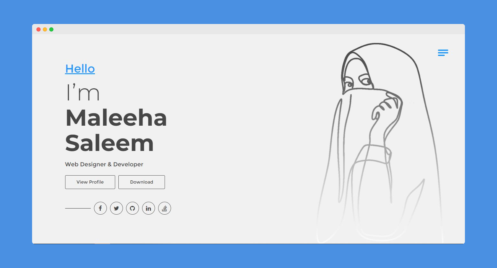

# hms-vuejs-online-cv-resume


<p align="center">
  
</p>

**[hms-vuejs-online-cv-resume](https://ayoubkhan-projects.github.io/hms-vuejs-online-cv-resume)**

## Project setup
```
npm install
```

### Compiles and hot-reloads for development
```
npm run serve
```

### Compiles and minifies for production
```
npm run build
```

### Run your tests
```
npm run test
```

### Lints and fixes files
```
npm run lint
```

### Installed CLI Plugins
babel typescript pwa eslint
